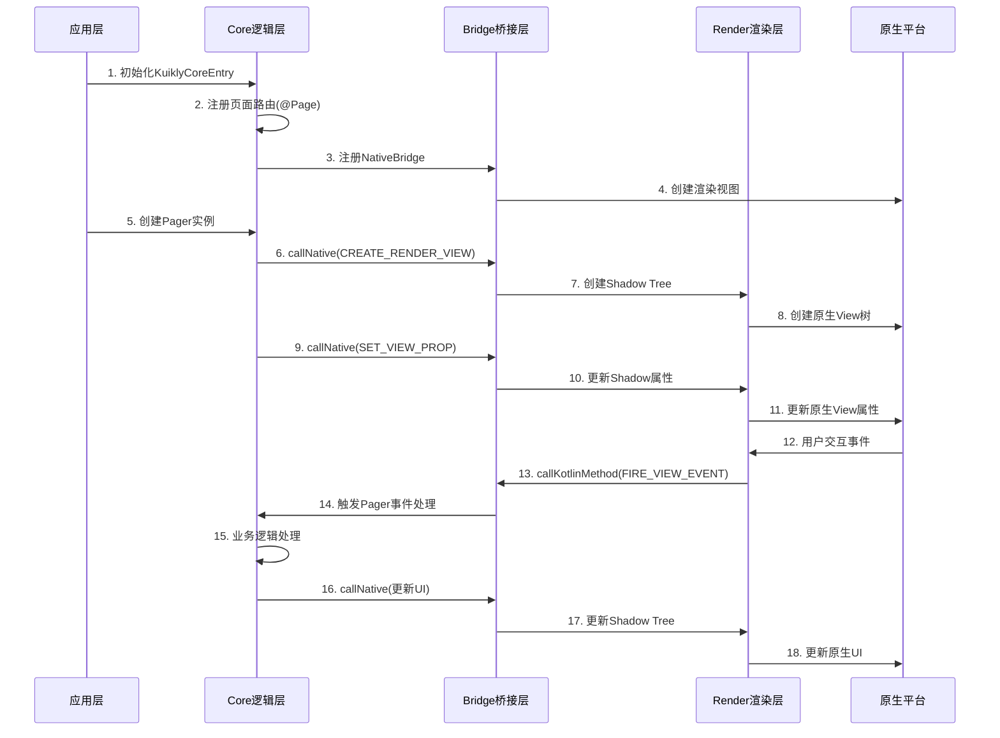
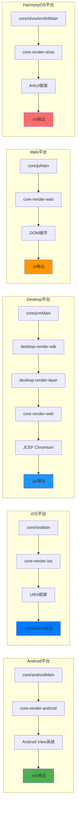

# KuiklyUI 架构层次图

## 整体架构层次图

```mermaid
graph TB
    subgraph "应用层 Application Layer"
        AndroidApp["Android App<br/>📱 Android 5.0+<br/>技术: Android SDK"]
        iOSApp["iOS App<br/>🍎 iOS 12.0+<br/>技术: UIKit/Swift"]
        DesktopApp["Desktop App<br/>🖥️ Windows/macOS/Linux<br/>技术: JCEF + Swing"]
        OhosApp["HarmonyOS App<br/>🌸 HarmonyOS Next 5.0+<br/>技术: ArkUI/ETS"]
        WebApp["Web App<br/>🌐 Browser<br/>技术: HTML5/JS"]
        MiniApp["Mini Program<br/>📦 WeChat/Alipay<br/>技术: 小程序框架"]
    end

    subgraph "SDK 层 SDK Layer"
        DesktopSDK["desktop-render-sdk<br/>🔧 JVM SDK<br/>技术: Kotlin/JVM<br/>原理: JS Bridge封装"]
    end

    subgraph "核心逻辑层 Core Logic Layer"
        subgraph "Core 模块"
            CoreCommon["core/commonMain<br/>📦 跨平台核心逻辑<br/>技术: Kotlin Multiplatform<br/>原理: 统一接口抽象"]
            CoreAndroid["core/androidMain<br/>🤖 Android实现<br/>输出: .aar"]
            CoreJVM["core/jvmMain<br/>☕ JVM实现<br/>输出: .jar"]
            CoreIOS["core/iosMain<br/>🍎 iOS实现<br/>输出: .framework"]
            CoreJS["core/jsMain<br/>🌐 JS实现<br/>输出: .js"]
            CoreOhos["core/ohosArm64Main<br/>🌸 HarmonyOS实现<br/>输出: .so"]
        end

        subgraph "Compose 模块"
            ComposeCommon["compose/commonMain<br/>🎨 Compose UI核心<br/>技术: Jetpack Compose 1.7.3<br/>原理: 声明式UI + 响应式"]
            ComposeAndroid["compose/androidMain<br/>🤖 Android Compose"]
            ComposeNative["compose/nativeMain<br/>🍎 iOS/Ohos Compose"]
            ComposeJS["compose/jsMain<br/>🌐 Web Compose"]
        end

        subgraph "核心能力"
            PagerManager["PagerManager<br/>📄 页面生命周期管理<br/>原理: 单例模式管理Pager实例"]
            BridgeManager["BridgeManager<br/>🌉 桥接通信管理器<br/>原理: 双向通信桥接<br/>callNative ↔ callKotlinMethod"]
            LayoutEngine["Layout Engine<br/>📐 Flex布局引擎<br/>技术: Yoga Layout算法"]
            AnimationEngine["Animation Engine<br/>✨ 动画引擎<br/>原理: 帧动画 + 插值器"]
            ModuleSystem["Module System<br/>🧩 模块化系统<br/>原理: 插件化架构"]
        end
    end

    subgraph "渲染层 Render Layer"
        RenderAndroid["core-render-android<br/>🎨 Android原生渲染<br/>技术: View系统<br/>原理: Shadow Tree → View Tree"]
        RenderIOS["core-render-ios<br/>🍎 iOS原生渲染<br/>技术: UIKit<br/>原理: Shadow Tree → UIView"]
        RenderOhos["core-render-ohos<br/>🌸 HarmonyOS原生渲染<br/>技术: ArkUI<br/>原理: Shadow Tree → Component"]
        RenderWeb["core-render-web<br/>🌐 Web渲染<br/>技术: DOM操作<br/>原理: Shadow Tree → DOM Tree"]
        DesktopRender["desktop-render-layer<br/>🖥️ Desktop Web渲染<br/>技术: Kotlin/JS编译<br/>原理: 复用core-render-web"]
    end

    subgraph "通信桥接层 Bridge Layer"
        NativeBridge["NativeBridge<br/>🌉 原生桥接接口<br/>原理: 平台特定实现<br/>callNative双向调用"]
        JSBridge["JS Bridge<br/>🔗 JavaScript桥接<br/>技术: cefQuery/WebView<br/>原理: 异步消息传递"]
    end

    subgraph "编译构建层 Build Layer"
        CoreAnnotations["core-annotations<br/>📝 注解定义<br/>@Page, @Module等"]
        CoreKSP["core-ksp<br/>⚙️ KSP注解处理器<br/>技术: Kotlin Symbol Processing<br/>原理: 代码生成<br/>生成: KuiklyCoreEntry"]
        CoreKAPT["core-kapt<br/>⚙️ KAPT注解处理器<br/>技术: Kotlin Annotation Processing<br/>原理: 兼容旧版本"]
        BuildSrc["buildSrc<br/>🔨 构建脚本<br/>技术: Gradle Kotlin DSL<br/>原理: 多版本构建配置"]
    end

    subgraph "工具链 Toolchain"
        IdeaPlugin["kuikly-idea-plugin<br/>🔌 IDE插件<br/>技术: IntelliJ Platform<br/>功能: 代码提示/预览"]
        DevTools["开发工具<br/>🛠️ Debug/Profiling<br/>技术: Chrome DevTools"]
    end

    %% 应用层到SDK层
    AndroidApp --> CoreAndroid
    iOSApp --> CoreIOS
    DesktopApp --> DesktopSDK
    DesktopSDK --> CoreJVM
    OhosApp --> CoreOhos
    WebApp --> CoreJS
    MiniApp --> CoreJS

    %% SDK层到核心层
    DesktopSDK --> JSBridge

    %% 核心层内部关系
    CoreCommon --> PagerManager
    CoreCommon --> BridgeManager
    CoreCommon --> LayoutEngine
    CoreCommon --> AnimationEngine
    CoreCommon --> ModuleSystem
    
    CoreAndroid --> CoreCommon
    CoreJVM --> CoreCommon
    CoreIOS --> CoreCommon
    CoreJS --> CoreCommon
    CoreOhos --> CoreCommon

    ComposeCommon --> CoreCommon
    ComposeAndroid --> ComposeCommon
    ComposeNative --> ComposeCommon
    ComposeJS --> ComposeCommon

    %% 核心层到渲染层
    CoreAndroid --> RenderAndroid
    CoreIOS --> RenderIOS
    CoreOhos --> RenderOhos
    CoreJS --> RenderWeb
    DesktopSDK --> DesktopRender
    DesktopRender --> RenderWeb

    %% 桥接层连接
    BridgeManager --> NativeBridge
    DesktopSDK --> JSBridge
    RenderWeb --> JSBridge

    %% 编译构建层
    CoreAnnotations --> CoreKSP
    CoreAnnotations --> CoreKAPT
    CoreKSP --> CoreCommon
    BuildSrc --> CoreAndroid
    BuildSrc --> CoreIOS
    BuildSrc --> CoreOhos

    %% 工具链
    IdeaPlugin --> CoreAnnotations
    DevTools --> RenderWeb

    style AndroidApp fill:#4CAF50
    style iOSApp fill:#007AFF
    style DesktopApp fill:#2196F3
    style OhosApp fill:#FF6B6B
    style WebApp fill:#FF9800
    style MiniApp fill:#9C27B0
    
    style CoreCommon fill:#FFC107
    style ComposeCommon fill:#FF9800
    style BridgeManager fill:#00BCD4
    style NativeBridge fill:#00BCD4
    
    style RenderAndroid fill:#4CAF50
    style RenderIOS fill:#007AFF
    style RenderWeb fill:#FF9800
    
    style CoreKSP fill:#673AB7
    style BuildSrc fill:#795548
```

## 数据流向图

## 平台特定实现对比

## 核心原理说明

### 1. 跨平台架构原理
- **Kotlin Multiplatform (KMP)**: 使用 KMP 实现逻辑层跨平台
- **统一接口抽象**: commonMain 定义接口，各平台实现
- **平台特定实现**: 通过 expect/actual 机制实现平台差异化

### 2. 渲染架构原理
- **Shadow Tree**: 逻辑层维护虚拟视图树
- **原生视图映射**: Shadow Tree 映射到平台原生视图树
- **增量更新**: 通过 Diff 算法实现高效更新

### 3. 通信桥接原理
- **双向通信**: callNative (逻辑→渲染) 和 callKotlinMethod (渲染→逻辑)
- **异步消息**: 通过消息队列实现跨线程/跨进程通信
- **类型转换**: 自动处理 Kotlin/JS/原生类型转换

### 4. 编译构建原理
- **KSP处理**: 编译时扫描 @Page 注解，生成 KuiklyCoreEntry
- **代码生成**: 自动生成页面注册和路由代码
- **多版本支持**: 通过 buildSrc 管理多版本构建配置

### 5. Desktop 特殊架构
- **JVM逻辑层**: core + compose 运行在 JVM 环境
- **Web渲染层**: 复用 core-render-web，编译为 Kotlin/JS
- **JS Bridge**: 通过 cefQuery 实现 JVM ↔ WebView 双向通信
- **Chromium内核**: 使用 JCEF 嵌入完整 Chromium 浏览器引擎

